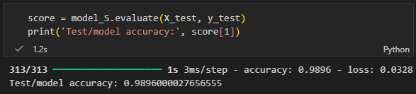

# Handwritten Digit Recognision Model
## Deep Learning | Computer Vision | TensorFlow & Keras

  
   
  <b>Live Demo: Real-time Hand-drawn Digit Classification</b>

<h2>📌 Project Overview</h2>
This ongoing project involves the design, implementation, and optimization of a Convolutional Neural Network (CNN) to classify handwritten digits (0-9). Developed in VS Code using Jupyter Notebooks, the project focuses on achieving high classification accuracy through systematic hyperparameter tuning and data-driven model refinement.
 
 
It was developed as a structured deep dive into the AI/ML technical stack to gain practical proficiency in Computer Vision and Neural Network architecture.
 

## 🛠️ Technical Stack
- Language: Python
- Frameworks: TensorFlow, Keras API</b> 
- Environment: VS Code / Jupyter (.ipynb)
- Libraries: NumPy (Data manipulation), Matplotlib (Visualization)

## 🏗️ Model Architecture
The network follows a sequential architecture designed to extract spatial features from grayscale imagery:
1. Input Layer: 28x28 grayscale images (MNIST Dataset).
2. Convolutional Layers: Feature extraction using 3x3 filters to detect edges and patterns.
3. Pooling Layers: Max-pooling to reduce dimensionality and improve computational efficiency.
4. Flatten Layer: turn 3D feature maps into 1D feature vectors to prepare for fully connected layers.
5. Dropout Layer: Implemented to prevent overfitting during training.
6. Dense Layer: Fully connected layer with Softmax activation for 10-class probability distribution.

## 📈 Optimization & Performance
To maximize the model's predictive power, I performed extensive hyperparameter adjustment, including:
- Optimizer Selection: Evaluated Adam for faster convergence.
- Learning Rate Tuning: Adjusted to balance training speed and stability.
- Batch Size Optimization: Tested various sizes to improve generalization.
- Results: Achieved a final test accuracy of 98.96%.

  
  
<i>Figure 1: Final model performance showing 98.96% test accuracy after 50 epochs</i>

<h2> Live Demonstration:</h2>
I developed a simple user API to allow users to input handwritten digit images and receive predictions from the model.

The model is failing to classify some of the iput provided on the digital board

  
   
  <b>Live Demo: Real-time Hand-drawn Digit Classification</b>

